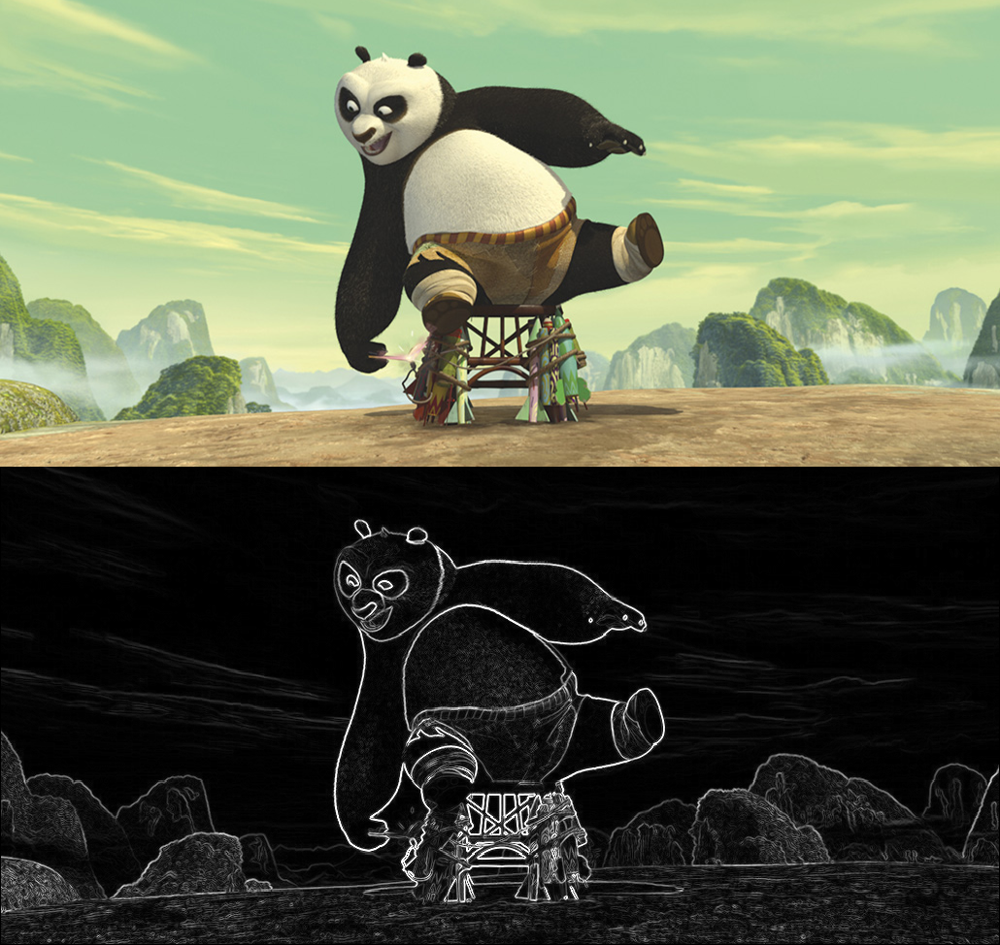
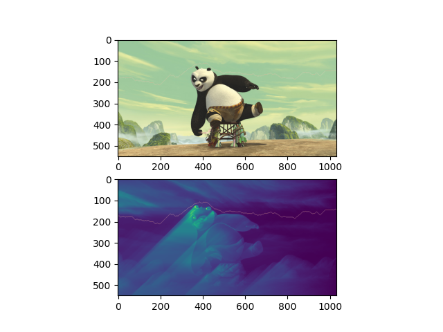
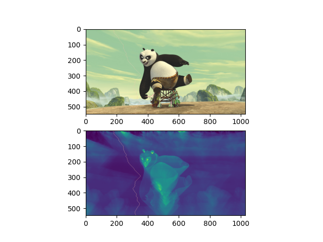

# squeeze
content-aware image resizing using seam carving algorithm written in python

## Getting Started
program guide:
```
usage: Remove specified columns and rows from input image. [-h] -i i [-c i] [-r i] [-v]

optional arguments:
  -h, --help  show this help message and exit
  -i i        image path
  -c i        -c <int> columns to remove, default: 0
  -r i        -r <int> rows to remove, default: 0
  -v          -v store each step seam into output directory, default: False (default: False)
```
example:
```bash
cd squeeze
sudo apt install virtualenv
virtualenv -p python3.9 venv #Install it in case it's not already installed
source venv/bin/activate
pip3 install -r requirements.txt

python3 main.py -i test/test_data/input.jpg  -c 2 -r 3 -v 
```

## Demos

#### dual-gradient energy calculation


#### horizontal seam


#### vertical seam
